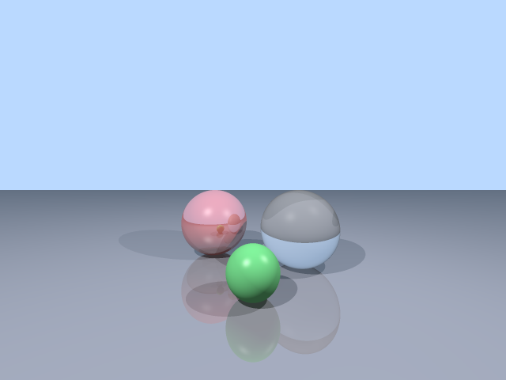

# Ray Tracer in C++

A software ray tracer that renders 3D scenes — spheres and planes with shadows, reflections, refractions, and anti-aliasing — to a PNG, with **no image or graphics libraries** (even the PNG encoder is hand-written).

## Demo

Rendering the default scene produces three spheres on a reflective floor:



```text
$ ./raytracer -o render.png --width 800 --height 600 --samples 3
Rendering... done.
Saved render.png (800x600, 9 spp)
```

The image shows a **red reflective sphere**, a **transparent glass sphere** (with refraction), and a **green sphere**, casting soft shadows and reflecting in the ground plane — all under a sky-blue background.

## Features

- **Ray-sphere and ray-plane intersection.**
- **Phong shading** with diffuse + specular highlights.
- **Shadows** — objects block light.
- **Recursive reflections** (mirror surfaces).
- **Refraction** — Snell's law with a Schlick Fresnel approximation (glass).
- **Anti-aliasing** — configurable samples per pixel.
- **Gamma-corrected output.**
- **Scene config files** — define spheres, planes, lights, and the camera in plain text.
- **Hand-written PNG encoder** — no libpng, no stb. Writes a valid PNG via uncompressed zlib blocks (opens in any viewer / Wireshark-grade correctness).

## Build & run

Requires a C++17 compiler.

### Linux
```bash
cd linux
make                 # or ./build.sh
./raytracer -o render.png --width 800 --height 600 --samples 3
```

### macOS (Apple Silicon & Intel)
```bash
cd mac
./build.sh           # uses clang++
./raytracer -o render.png --samples 3
```

### Windows
```powershell
cd windows
build.bat
raytracer.exe -o render.png --samples 3
```

## Usage

```bash
./raytracer                                   # default scene -> render.png
./raytracer -o out.png --width 1280 --height 720 --samples 4
./raytracer --scene ../examples/scene.txt -o custom.png
```

| Flag | Meaning |
|------|---------|
| `-o FILE` | output PNG path |
| `--width N` / `--height N` | image dimensions |
| `--samples N` | anti-aliasing samples per axis (N² rays/pixel) |
| `--scene FILE` | load a scene config |

## Scene file format

```text
camera 0 1 5
plane  0 -1 0   0 1 0   0.3 0.3 0.35  0.2          # point, normal, color, reflectivity
sphere -1.2 0 -1  1.0   0.9 0.2 0.2   0.4 0.0       # center, radius, color, reflect, transparency
sphere  1.2 0  0  1.0   0.9 0.9 0.9   0.0 0.8       # a glass sphere
light  -3 5 5 0.8                                   # position, intensity
```

See `examples/scene.txt`.

> **Note on the "GPU" name:** this is a CPU ray tracer (single-file, portable). The code is structured so the per-pixel `trace()` loop maps cleanly onto a CUDA kernel — a natural extension if you have an NVIDIA GPU.

## Tech stack

- **C++17**, single file, zero dependencies
- Vector math, recursive ray tracing, hand-written PNG encoder

---

Built by clavexis — [github.com/clavexis](https://github.com/clavexis)
